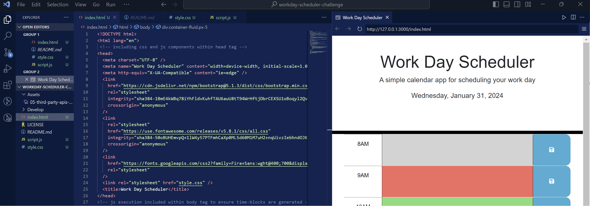

# Work Day Scheduler Starter Code
Assignment Description: Create a simple calendar application that allows a user to save events for each hour of a typical working day (9am–5pm). This app will run in the browser and feature dynamically updated HTML and CSS powered by jQuery.

Screenshot path: module.5.challenge.work-day-scheduler.png

Notes: When planner link is deployed, the current date is displayed at the top of the screen. Blocks are presented for standard business hours. Time-blocks are color-coded to show whether they are in the past/present/future. when clicking into a time block, entries can be made for specific events. entries can be used by pressing "save"button. when page is refreshed, all evens created remain. 

Code refactor starter code came from: https://github.com/coding-boot-camp/crispy-octo-meme

Deployment URL: https://cocho011.github.io/workday-scheduler-challenge/
